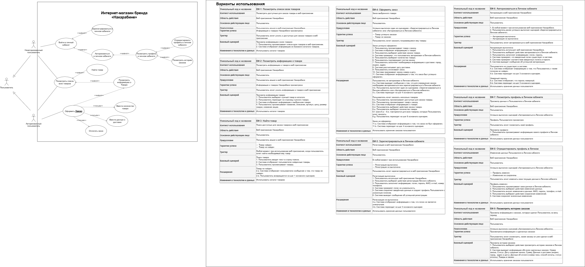

# SA-Portfolio
Этот репозиторий содержит проекты по System Analyst, в которых представлены весь доступный мне инструментарий

## Моделирование данных

- [Интернет-магазин](https://github.com/Nykiota/SA-Portfolio/blob/main/text%20docs/data%20modeling.xml) - исходный файл
-  - Use Case

text docs/models/4. Моделирование данных -№1. Use Case.drawio.png

## User Story
- исходный файл

 ## Прототипы
- исходный файл

 ## Интеграции
- исходный файл

